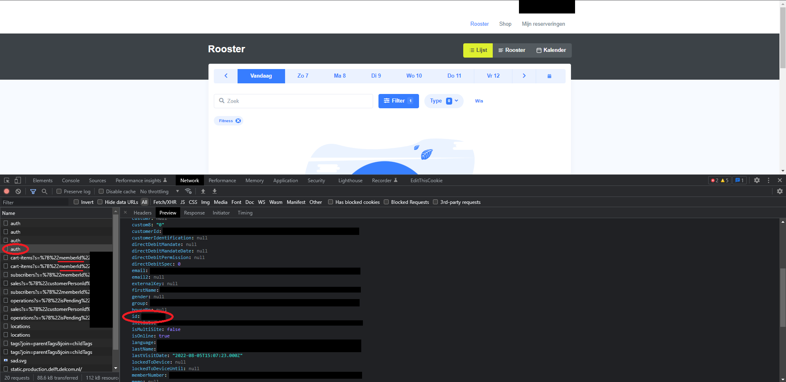

# Xbook
Xbook is a command line utility written in Python 3 that allows users to quickly book a desired activity time slot without having to navigate the X webpage. Additionally, it can continually check a given time slot's availability and book it as soon as it is no longer fully booked by other participants, granting as many people as possible the opportunity to get their gains in the event of cancellations.

# Installation
At the time of writing, Xbook is not available on any package managers. You may therefore install it by cloning the source, installing the requirements with `pip`, and adding it to your PATH so it may be run from anywhere:
```bash
git clone https://github.com/fistaco/xbook.git
cd xbook
python -m pip install -r requirements.txt
python ./src/xbook.py -h
```

For the sake of convenience, it is recommended to add Xbook's `src` directory to your PATH, potentially with `xbook` as an alias.

# Usage
Call `xbook.py` with a given date and hour to attempt to book the corresponding time slot at X. If no category is specified, Xbook will try to book a fitness time slot. Booking attempts will continue until the booking is successful or until Xbook is forcefully stopped.
```bash
$ xbook.py -h
usage: xbook [-h] [--password password] [--utc] [--booking-category BOOKING_CATEGORY] [--court {1,2,3,4}] date hour

Book an activity time slot at X.

positional arguments:
  date                  The date on which you want to book a time slot. Example: 2024-01-13
  hour                  The hour at which your desired slot commences. Example: 09

options:
  -h, --help            show this help message and exit
  --password password   The password you use to log in to X's website.
  --utc                 Whether or not the provided date and hour are in UTC.
  --booking-category BOOKING_CATEGORY, -b BOOKING_CATEGORY
                        The category for which xbook should book a slot.
  --court {1,2,3,4}, -c {1,2,3,4}
                        The beach volleyball court to book.
```
The terminal output below showcases a standard usage example that books the fitness time slot from 17:00 to 18:00 on August 9th 2022. Note that the given `hour` value corresponds to the desired time in the Netherlands, while the output and X's backend deal with timestamps in UTC
```bash
> xbook.py 2022-08-09 17
Password for X login:
Checking availability for gym slot at 2022-08-09T15:00:00.000Z.
Authenticating with method 'OTHER'...
Attempting to book slot...
Succesfully booked slot at 2022-08-09T15:00:00.000Z (UTC)!
Terminating session and exiting.
```
Booking attempts for other categories can be made by specifying a category with `--booking-category` or `-b`. Xbook will use fuzzy search to find the closest match to the provided category, e.g., the following commands are all valid:
```bash
xbook.py 2024-10-01 16 -b x1a
xbook.py 2024-10-01 16 -b hall_x1a
xbook.py 2024-10-01 16 -b x1  # Resolves to "Hall X1A"
xbook.py 2024-10-01 16 -b gym
xbook.py 2024-10-01 16 -b beach  # Resolves to "Beach volleyball court"
xbook.py 2024-10-01 16 -b volley  # Resolves to "Beach volleyball court"
```

# Examples
Continuously attempt to book the fitness time slot at 16:00 on 12 March 2021:
```bash
xbook.py 2021-03-12 16
```
Continuously attempt to book the fitness time slot at 09:00 on 26 October 2021 without having to wait for a prompt to enter your password:
```bash
xbook.py 2021-10-26 9 --password iceddecafoatmilklatteonsundayaftergym
```
Continuously attempt to book hall X3B at 20:00 on 10 January 2022:
```bash
xbook.py 2022-01-10 20 --booking-category x3b
```
Continuously attempt to book beach volleyball court 1 at 19:00 on 30 July 2024:
```bash
xbook.py 2024-07-30 19 --booking-category beach --court 1
```

# Configuration
In order to work, Xbook requires the user to set their username, member id, and authentication method in `config.json`, which looks as follows:
```
{
    "netid": "yourNetId",
    "email": "a@b.c",
    "member_id": "1234567",
    "auth_method": "other",
    "_comment": "The 'auth method' value should be 'tud_sso' or 'other'."
}
```
The `netid` and `email` values are self-explanatory, and the `auth_method` value should describe the method you use to log into X. If you're a student or employed at the TU Delft with a valid NetID, this method will likely be `tud_sso` and you'll only have to define your `netid`, whereas alumni or others without a valid NetID should choose `other` and only have to define a value for the `email` field.

Your `member_id` is necessary to create a valid booking and can be automatically determined by Xbook in most cases. However, when Xbook fails to do so for whatever reasonn, one solution may be to set it in config.json yourself. You can find your member ID by logging into X, clicking "My Profile" in the top right, and copy-pasting the value given in the "Person id" row.

