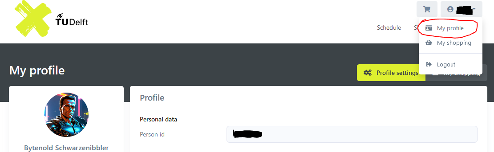

# Xbook
Xbook is a command line utility written in Python 3.10.2 that allows users to quickly book a desired fitness time slot without having to navigate the X webpage. Additionally, it can continually check a given time slot's availability and book it as soon as it is no longer fully booked by other participants, granting as many people as possible the opportunity to get their gains in the event of cancellations.

# Usage
Call `xbook.py` with a given date and hour to attempt to book the corresponding fitness time slot at X. Xbook will continue to attempt to book the slot until the booking is successful or until it is forcefully stopped.
```
> python xbook.py -h
usage: xbook [-h] [--password password] [--utc] date hour

Book a fitness time slot at X.

positional arguments:
  date                 The date on which you want to book a time slot (YYYY-MM-DD).
  hour                 The hour at which your desired slot commences.

options:
  -h, --help           show this help message and exit
  --password password  The password you use to log in to X's website.
  --utc                Whether or not the provided date and hour are in UTC.
```
The terminal output below showcases a standard usage example that books the fitness time slot from 17:00 to 18:00 on August 9th 2022. Note that the given `hour` value corresponds to the desired time in the Netherlands, while the output and X's backend deal with timestamps in UTC. 
```
> python xbook.py 2022-08-09 17
Password for X login:
Checking availability for gym slot at 2022-08-09T15:00:00.000Z.
Authenticating with method 'OTHER'...
Attempting to book slot...
Succesfully booked slot at 2022-08-09T15:00:00.000Z (UTC)!
Terminating session and exiting.
```

# Configuration
In order to work, Xbook requires the user to set their username, member id, and authentication method in `config.json`, which looks as follows:
```
{
    "netid": "yourNetId",
    "email": "a@b.c",
    "member_id": "1234567",
    "auth_method": "other",
    "_comment": "The 'auth method' value should be 'tud_sso' or 'other'."
}
```
The `netid` and `email` values are self-explanatory, and the `auth_method` value should describe the method you use to log into X. If you're a student or employed at the TU Delft with a valid NetID, this method will likely be `tud_sso` and you'll only have to define your `netid`, whereas alumni or others without a valid NetID should choose `other` and only have to define a value for the `email` field. Your `member_id` is necessary to create a valid booking and can be automatically determined when choosing `other` as the `auth_method`. However, due to the lack of a TUD account to test with, NetID users will have to configure it manually. You can find your member ID by logging into X while keeping the network tab in your browser's developer toolkit (F12) open as shown in the image below. To increase ease of use, determining the required `member_id` automatically for TUD SSO users during authentication is a high priority feature that will be implemented as soon as a testing account becomes available.

